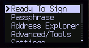
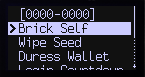
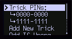
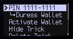
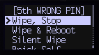

# Trick PINs

The **Coldcard&reg;** MK4 introduces a new concept called Trick PINs. These PIN codes are any PIN other than the True PIN, and are configured by the user to perform specific actions. Users can have many Trick PINs on their device, and each one can perform unique actions.

The Trick PIN settings can be found under: `Settings > Login Settings > Trick PINs`

## Adding a New Trick PIN

1. In the Trick PIN menu you will select `Add New Trick`.

2. You will be presented with a screen to enter the prefix of your new Trick PIN. Enter your preferred Trick PIN prefix and press `OK(✓)`.

3. The next screen will show your anti-phishing words. To continue press `OK(✓)`.

4. You will now be asked to enter the suffix of your Trick PIN, do so and press `OK(✓)`.

5. The next step will show the Trick PIN you set at the top (`0000-0000` in this example) and give you options for what happens when this PIN is entered. These are your choices:
   
   
   
   + **`Brick Self`**: The device becomes completely useless, and will only display the word `Bricked` forever.
   
   + **`Wipe Seed`**: Wipe the seed, or pretend to, via one of the following options:
     
     + **`Wipe & Reboot`:** The seed is wiped, and the Coldcard reboots without any notice.
     
     + **`Silent Wipe`:** The seed is silently wiped, and the Coldcard acts as if the PIN was just entered incorrectly.
     
     + **`Wipe -> Wallet`:** The seed is silently wiped, and the Coldcard logs into a duress wallet of your choice. The duress wallet can be 1 of 3 [BIP-85](https://github.com/bitcoin/bips/blob/master/bip-0085.mediawiki) wallets, or a legacy wallet.
   
   + **`Say Wiped, Stop`:** The seed is wiped and the Coldcard will display a message saying: `Seed is wiped, Stop`.
   
   + **`Duress Wallet`:** This leads to a duress wallet only, but the Coldcard acts as if the True PIN was entered. The main wallet is not accessible. The duress wallet can be 1 of 3 [BIP-85](https://github.com/bitcoin/bips/blob/master/bip-0085.mediawiki) wallets, or a legacy wallet.
   
   + **`Login Countdown`:** The Coldcard displays a login countdown timer for one hour, and does one of the following options:
     
     + **`Wipe & Countdown`:** The seed is wiped and then the countdown begins.
     
     + **`Countdown & Brick`:** Does the countdown, and then bricks the device.
     
     + **`Just Countdown`:** Does the countdown, and then resets. The seed is not wiped and the Coldcard is not bricked.
   
   + **`Look Blank`:** The Coldcard will look and act as if it was just wiped, but will not actually wipe the seed.
   
   + **`Just Reboot`:** The Coldcard will just reboot. Nothing else happens.
   
   + **`Delta Mode`:** Delta Mode is designed to defend against attackers that know the specific wallet they're looking for. This information is easy to leak via watch-only wallets on a users computer or phone. This is the most advanced option, and not recommended for novices.
     
     In Delta Mode the attacker will have access to the main wallet of the Coldcard, and be able to do most things. However, they will not be able to spend funds from the wallet or view the seed. Attempting to view the seed will wipe it.
     
     To use Delta Mode the prefix of the Trick PIN must match the True PIN. Only the final four digits of the Trick PIN should be different from the True PIN.

6. Once you understand your options, select one (and possibly it's sub-option) and press `OK(✓)`.

## Make Changes to an Existing Trick PIN

Once created, existing Trick PINs can be found in the Trick PINs menu. From there you can hide, delete, or change the trick's PIN. In the case where a Trick PIN is set to open a duress wallet, that wallet can be activated from here.

1. To interact with an existing Trick PIN, select the pin you wish to make changes to from the menu and press `OK(✓)`.

2. The next screen will show your selected PIN at the top, the action it's set to perform, and some options. These are your choices:
   
   
   
   + **`Activate Wallet`:** *This option is only available if the Trick PIN is set to open a duress wallet.* When selected, this will load the trick wallet onto the Coldcard so you can make transactions with it. Reset the Coldcard to get back to the main wallet.
   
   + **`Hide Trick`:** Hides the trick from the Trick PIN menu, but will not deactivate it. To restore the trick to the menu, attempt to add the PIN as a new trick.
   
   + **`Delete Trick`:** Deactivates and removes the Trick PIN from the Coldcard.
   
   + **`Change PIN`:** Changes the PIN of a trick.

3. If you would like to perform any of these actions, select it and press `OK(✓)`.

## Adding a Special Handling for Wrong PIN Attempts

In the Trick PINs menu, you have the option to choose what the Coldcard does after a user defined number of incorrect PINs are entered. **The Coldcard will always brick after 13 failed PIN attempts regardless of any settings here.**

1. In the Trick PIN menu you will select `Add If Wrong`.

2. Read the explanation and press `OK(✓)`.

3. Choose the number of wrong attempts that should trigger your next choice, press `OK(✓)`.

4. The next step will show you the number you chose for incorrect attempts at the top, and give you options for what happens after this attempt. These are your choices:
   
   
   
   + **`Wipe, Stop`:** The seed is wiped and the Coldcard will display a message saying: `Seed is wiped, Stop`.
   
   + **`Wipe & Reboot`:** The seed is wiped, and the Coldcard reboots without any notice.
   
   + **`Silent Wipe`:** The seed is silently wiped, and the Coldcard acts as if the PIN was just entered incorrectly.
   
   + **`Brick Self`:** The device becomes completely useless, and will only display the word `Bricked` forever.
   
   + **`Last Chance`:** The seed is wiped, and
   
   + **`Just Reboot`:** The Coldcard will just reboot. Nothing else happens.

5. Once you understand your options, select one and press `OK(✓)`.

## Deleting all Trick PINs and Wrong PIN Handling

The final option in the Trick PINs menu is `Delete All`. Selecting this will delete all of your Trick PINs and special wrong PIN handling.
